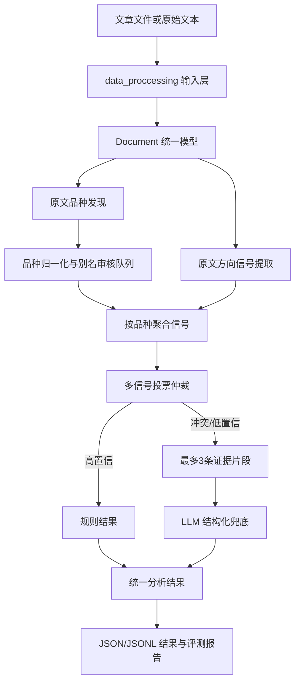

# MarketANA 数据处理独立实现计划

> 目标：在 `data_proccessing/` 目录内完成一套可独立运行的“文章读取 → 品种发现 → 方向信号提取 → 多信号投票 → LLM 兜底 → 结果输出 → 评测”的数据处理系统。
>
> 约束：本计划中的新增代码不得依赖 `pn03`、`pn04` 或其他 `pn*` 模块。后续删除 `pn*` 目录后，`data_proccessing/` 仍应可以单独运行和测试。
>
> 说明：仓库当前目录名是 `data_proccessing`，虽然英文拼写不标准，但本阶段保留该目录名，避免改变已有导入路径。

## 当前实现状态

本计划已完成第一版独立实现：

- 阶段 0～8 的核心 Python 模块已创建于 `data_proccessing/`；
- `instrument_mapping/seed_catalog.py` 已不再依赖 `pn06`；
- 已具备 Reader、运行时词典、信号提取、投票、LLM 解析、批处理、JSONL 输出、评测和 CLI；
- `uv run pytest data_proccessing -q`：`21 passed, 2 skipped`；
- 使用 `SCHEDULER_POLL_INTERVAL_SECONDS=300 uv run pytest -q`：`224 passed, 2 skipped`；
- `uv run python -m data_proccessing.cli check-isolation` 已通过。

当前标准品种目录以 `catalog/catalog.py` 作为 Python 内置数据源，运行时不依赖 `pn06`；后续如需给非 Python 工具使用，再增加 JSON 导出即可，不影响当前独立流水线。

## 一、最终交付目标

完成后，系统应能对一批 PDF、HTML、PNG/JPG 或已经解析好的 TXT 文章执行以下流程：



最终必须具备：

1. 不依赖 `pn*` 的独立 Python 包。
2. 现有映射构建能力升级为“已知映射 + 原文自发现 + 审核队列”。
3. 方向识别不再只依赖全文关键词计数，而是保留证据片段并进行加权投票。
4. LLM 只处理规则无法确定的情况，输入限制为与品种相关的少量片段。
5. 有可重复运行的评测集、指标报告和端到端样例。
6. 所有中间结果和最终结果均可脱离数据库先以 JSON/JSONL 形式保存，便于调试和验收。

## 二、现状与必须先处理的问题

当前已经存在：

- `instrument_mapping/`：种子品种、原文候选发现、证据评分、词典产物和单元测试。
- `instrument_lexicon.json`：当前词典产物。
- `alias_candidates.jsonl`：候选别名及证据片段。
- `build_report.json`：本次构建统计报告。

当前需要修正：

1. `instrument_mapping/seed_catalog.py` 依赖 `pn06.product_catalog`，必须迁移为 `data_proccessing` 内部目录。
2. 当前映射产物是离线文件，尚未形成独立运行时加载接口。
3. 当前 `auto_approved=0`、`review_required=0` 时，无法验证新别名审核闭环是否真实工作。
4. 当前没有方向信号对象、证据跨度、投票仲裁和 LLM 兜底上下文模型。
5. 当前没有独立的批处理入口、评测入口和统一输出格式。
6. 当前不能把“发现候选”直接等同于“品种识别正确”，必须加入人工标注评测。

## 三、目录与模块设计

目标目录如下。第一阶段可以逐步创建，不要求一次完成全部文件。

```text
data_proccessing/
├── __init__.py
├── config.py                    # 独立配置，不读取 pn 或 back_end
├── models.py                    # 文档、品种、信号、投票、分析结果模型
├── errors.py                    # 输入、配置、解析和结果校验异常
├── catalog/
│   ├── __init__.py
│   ├── catalog.json             # 自有标准品种目录
│   ├── loader.py                # 目录加载与校验
│   └── aliases.py               # 别名、合约代码、负向上下文索引
├── readers/
│   ├── __init__.py
│   ├── base.py                  # Reader 协议
│   ├── text_reader.py           # TXT/已解析文本
│   ├── html_reader.py           # HTML 正文读取
│   ├── pdf_reader.py            # PDF 文本读取
│   └── image_reader.py          # PNG/JPG OCR 读取
├── instrument_mapping/
│   ├── ...                      # 现有 guided self-discovery 模块
│   ├── runtime.py               # 词典运行时加载与匹配
│   ├── review.py                # 候选审核队列导入/导出
│   └── tests/
├── signals/
│   ├── __init__.py
│   ├── patterns.py              # 方向、价格、供需、技术、情绪模式
│   ├── extractor.py             # 在 raw_text 上提取信号
│   ├── context.py               # 否定、条件、历史语境判断
│   ├── aggregator.py            # 信号按品种聚合
│   ├── arbitrator.py            # 多信号加权投票
│   └── tests/
├── llm/
│   ├── __init__.py
│   ├── client.py                # 独立 LLM 客户端协议与 HTTP 实现
│   ├── context.py               # 最多3条证据片段构造
│   ├── parser.py                # JSON 解析与字段校验
│   └── tests/
├── pipeline/
│   ├── __init__.py
│   ├── processor.py             # 单文档处理
│   ├── batch.py                 # 批处理和进度统计
│   └── outputs.py               # JSON/JSONL 输出
├── evaluation/
│   ├── schema.py                # 标注数据结构
│   ├── runner.py                # 评测执行
│   ├── metrics.py               # 指标计算
│   └── report.py                # Markdown/JSON 报告
├── cli.py                       # 统一命令行入口
└── tests/                       # 跨模块和端到端测试
```

硬性依赖规则：

- `data_proccessing` 内部模块之间可以互相依赖。
- 不允许出现 `from pn...`、`import pn...`。
- 不允许从 `back_end`、`front_end` 读取业务模型或 Repository。
- 不能把数据库作为单元测试前置条件；默认使用内存对象和 JSON/JSONL。
- LLM 客户端必须可注入 mock，测试默认不访问真实网络。

## 四、核心数据契约

### 4.1 统一文档模型

在 `data_proccessing/models.py` 中定义：

```text
Document
  source_id: str
  file_name: str
  file_type: str
  title: str
  raw_text: str
  metadata: dict
```

所有 Reader 只负责生成 `Document`，后续模块不再关心输入来自 PDF、HTML、图片还是 TXT。

### 4.2 品种候选模型

保留现有 `AliasCandidate`，补充以下字段：

```text
AliasCandidate
  raw_alias
  normalized_alias
  suggested_product_key
  status: approved_seed | auto_approved | review_required | rejected
  score
  occurrence_count
  document_count
  evidence_types
  evidence_snippets
  source_docs
  negative_reasons
```

状态规则：

- `approved_seed`：标准目录中已有的确定别名。
- `auto_approved`：已关联标准品种，满足至少两类独立证据且分数达到自动通过阈值。
- `review_required`：候选形态可信，但需要人工确认标准品种或是否为真实品种。
- `rejected`：机构名、免责声明、数字、坐标、外盘语境或明显噪声。

### 4.3 方向信号模型

在 `signals/extractor.py` 中统一输出：

```text
DirectionSignal
  signal_id: str
  product_key: str | None
  raw_alias: str
  direction: bullish | bearish | neutral
  signal_type: direction_word | price_change | percentage | supply_demand |
               technical | sentiment | position | momentum
  phrase: str
  value: float | None
  confidence: float
  start: int
  end: int
  evidence_text: str
  context_flags: tuple[str, ...]
```

`start/end` 必须来自 `raw_text`，用于前端或人工复核时定位原文证据。

### 4.4 投票结果模型

```text
ArbitrationResult
  product_key
  display_name
  direction: 看涨 | 看跌 | 中性 | None
  bullish_score
  bearish_score
  neutral_score
  margin
  confidence
  decision: rule_accept | llm_fallback | manual_review | no_signal
  signals
  evidence_snippets
```

### 4.5 最终分析结果模型

```text
AnalysisResult
  source_id
  product_key
  product
  direction
  reason
  confidence
  method: rule | llm | manual
  need_manual_review
  evidence
  processing_stats
```

## 五、分阶段实施计划

### 阶段 0：解除 pn 依赖并冻结接口

目标：让 `data_proccessing` 能在没有任何 `pn*` 代码的情况下被导入。

任务：

1. 从 `pn06.product_catalog` 整理出完整标准目录，写入 `catalog/catalog.json`。
2. 在 `catalog/loader.py` 实现目录加载、字段校验、重复 `product_key` 校验。
3. 将 `seed_catalog.py` 改为只依赖 `catalog.loader` 和本目录模型。
4. 建立 `data_proccessing/config.py`，配置包括：
   - `auto_approve_threshold=0.72`
   - `review_threshold=0.35`
   - `rule_accept_threshold=0.70`
   - `llm_fallback_margin=0.20`
   - `max_llm_snippets=3`
   - `max_llm_chars=1200`
5. 增加导入隔离测试，扫描 `data_proccessing` 源码，断言不存在 `pn` 和 `back_end` 导入。

验收：

```bash
uv run python -c "import data_proccessing; import data_proccessing.instrument_mapping"
uv run pytest data_proccessing -q
```

### 阶段 1：完善独立输入层

目标：不使用 `pn04`，在本目录内把多种文件统一为 `Document`。

任务：

1. `text_reader.py`：读取 UTF-8、带 BOM 和常见编码的 TXT。
2. `html_reader.py`：移除 `script/style`、明显导航和广告节点，保留正文文本及标题。
3. `pdf_reader.py`：使用 PyMuPDF 按页读取文本，保留页码标记。
4. `image_reader.py`：通过可注入 OCR 函数读取 PNG/JPG；未安装 OCR 时返回明确错误，不静默生成空文本。
5. 所有 Reader 输出 `raw_text`，不得在输入层做方向判断。
6. Reader 失败时返回结构化错误，包括 `source_id`、`stage`、`error_type`、`message`。

验收样例：

- 1 个 TXT；
- 1 个 HTML；
- 1 个 PDF；
- 1 个图片或 OCR mock；
- 1 个损坏文件；
- 1 个空文档。

### 阶段 2：完成引导式品种自发现运行时闭环

目标：将已有离线构建器升级为可以被处理流水线调用的组件。

任务：

1. 保留 `InstrumentDiscoverer` 的多类证据：合约代码、方括号标题、品种字段、中文后缀、市场上下文、OCR 分裂代码。
2. 新增 `instrument_mapping/runtime.py`：
   - 加载 `instrument_lexicon.json`；
   - 构建 alias → product_key 索引；
   - 构建 product_key → aliases 索引；
   - 支持负向上下文过滤；
   - 输出匹配跨度和证据来源。
3. 新增 `review.py`：
   - 将 `review_required` 候选导出为 JSONL；
   - 接收人工审核 JSONL；
   - 合并已批准别名并重新构建词典；
   - 保留审核人、时间、备注和原始证据。
4. 对于未知但无法关联 `product_key` 的候选，不自动加入全局词典，只进入审核队列。
5. 对外提供稳定接口：

```python
lexicon = load_runtime_lexicon(path)
matches = lexicon.find_matches(document.raw_text, title=document.title)
```

验收指标：

- 已知合约代码识别率达到 100%（基于测试目录）；
- 外盘语境不污染国内品种；
- OCR 分裂代码可恢复；
- 发现未知候选时能生成可人工阅读的证据片段；
- 词典加载不依赖 `pn06`。

### 阶段 3：实现原文方向信号提取

目标：在 `raw_text` 上提取短、稳定、可定位的信号；清洗文本只作为辅助展示输入。

任务：

1. `signals/patterns.py` 建立模式组：
   - 明确方向：看涨、看空、上涨、下跌、偏强、偏弱、反弹、回落；
   - 价格变化：涨幅、跌幅、上涨 X 元、下跌 X%；
   - 供需关系：库存下降、供应收紧、需求改善、供给增加；
   - 技术信号：突破、破位、金叉、死叉、新高、新低；
   - 动量信号：连续上涨、连续下跌、反弹延续；
   - 情绪词：乐观、悲观、谨慎、观望；
   - 中性信号：震荡、区间、盘整、方向不明。
2. 每个模式必须绑定 `signal_type`、方向、基础权重和证据模板。
3. 使用品种匹配跨度建立局部窗口，默认品种前后各 80 个字符，防止整篇文章互相污染。
4. `context.py` 处理：
   - 否定：不涨、未见上涨、并非看涨；
   - 条件：若……则……、一旦……；
   - 转折：但、然而、不过；
   - 历史：昨日、此前、过去一周；
   - 风险提示：风险在于、需警惕、存在下行风险。
5. 不允许只因出现“上涨”两个字就直接判为看涨，必须保留上下文标记。

单元测试至少覆盖：

```text
螺纹钢库存下降，需求改善，短期偏强       → 看涨
原油上涨后回落，短期仍面临压力             → 看跌或冲突
若库存继续下降，价格有望反弹               → 条件看涨
昨日上涨，今日高开低走                     → 不能简单判为看涨
市场震荡运行，方向暂不明确                 → 中性
COMEX黄金上涨，国内沪金偏弱                 → 外盘语境隔离
```

### 阶段 4：实现多信号聚合与投票仲裁

目标：用可解释的统计规则替代单关键词决定。

建议初始权重：

| 信号类型 | 基础权重 | 说明 |
|---|---:|---|
| 明确观点词 | 1.00 | 看涨、看跌、做多、做空 |
| 价格涨跌幅 | 0.90 | 带数值的直接变化 |
| 供需关系 | 0.75 | 库存、供应、需求 |
| 技术信号 | 0.70 | 突破、破位、新高 |
| 动量信号 | 0.65 | 连续上涨、连续下跌 |
| 情绪词 | 0.45 | 乐观、谨慎、观望 |
| 中性词 | 0.50 | 震荡、区间、盘整 |

任务：

1. `aggregator.py` 按 `product_key` 聚合信号。
2. 相同证据片段重复命中时去重，避免一条句子重复投票。
3. 对否定、条件、历史和风险语境进行权重折扣。
4. `arbitrator.py` 计算三类方向分数：

```text
direction_score = Σ(signal_weight × context_factor × signal_confidence)
```

5. 初始决策规则：

```text
最高分 >= 1.50 且与第二名差值 >= 0.50 → rule_accept / high
最高分与第二名差值 >= 0.20             → rule_accept / medium
差值 < 0.20 或存在强冲突                 → llm_fallback
没有有效信号                              → no_signal
```

6. 规则结果必须携带 `signals` 和 `evidence_snippets`，不能只保存最终方向。

验收：

- 每个方向结果都能追溯到至少一条证据；
- 同一品种多个句子的结论能够合并；
- 多品种文章不会把 A 品种的方向词分配给 B 品种；
- 冲突案例进入 LLM 兜底，而不是强行给出高置信方向。

### 阶段 5：实现独立 LLM 兜底

目标：仅向 LLM 提供少量相关证据，输出可校验的结构化结果。

任务：

1. `llm/client.py` 定义 `LLMClient` 协议，并提供 HTTP 实现。
2. API Key、Base URL、模型名和超时只从 `data_proccessing/config.py` 读取。
3. `llm/context.py`：
   - 按品种匹配证据；
   - 最多 3 条片段；
   - 默认最多 1200 字符；
   - 携带规则投票分数和冲突说明；
   - 不发送无关全文。
4. `llm/parser.py` 校验：
   - JSON 或 Markdown JSON；
   - 品种是否存在于标准目录或审核候选；
   - 方向是否为看涨/看跌/中性；
   - 置信度是否在 0～1；
   - 理由是否为空；
   - 多结果是否可以解析。
5. LLM 失败时输出 `llm_error`，不得伪造方向结果。
6. `confidence < 0.50` 的结果标记 `need_manual_review=true`。
7. 默认使用 mock client 测试，真实 LLM 只通过显式 CLI 参数启用。

验收指标：

- 规则高置信样例不调用 LLM；
- 冲突样例最多发送 3 条证据；
- 超时、非法 JSON、非法方向均能结构化失败；
- 可以统计规则结果与 LLM 结果的数量和耗时。

### 阶段 6：组装独立单文档与批处理流水线

目标：在本目录内完成可重复运行的处理入口，不使用 Scheduler、Pipeline 或后端 Repository。

`pipeline/processor.py` 的单文档流程：

```text
Document
  → runtime lexicon 匹配品种
  → raw_text 提取信号
  → 按品种聚合
  → 投票仲裁
  → 高置信规则结果 / LLM 兜底 / 人工审核
  → AnalysisResult
```

`pipeline/batch.py` 负责：

- 目录递归读取；
- 文件类型分发给 Reader；
- 单篇失败不阻断整批；
- 记录成功数、失败数、规则数、LLM 数、审核数；
- 输出每篇文章的处理耗时。

`pipeline/outputs.py` 输出：

```text
results.jsonl             # 每行一个 AnalysisResult
processing_report.json    # 批处理统计
review_queue.jsonl        # 品种/方向人工审核项
evidence.jsonl            # 可选，保留详细信号证据
```

幂等规则：相同 `source_id + content_hash + pipeline_version` 不重复追加结果；重新运行时覆盖同版本结果或写入新版本文件。

### 阶段 7：建立评测集和自动化报告

目标：用人工标注验证品种识别、方向识别和 LLM 降本效果。

目录：

```text
data_proccessing/evaluation/dataset.jsonl
data_proccessing/evaluation/baseline.json
data_proccessing/evaluation/reports/latest.json
data_proccessing/evaluation/reports/latest.md
```

标注格式：

```json
{
  "source_id": "doc-001",
  "product_key": "SHFE.RB",
  "direction": "看涨",
  "evidence": ["库存下降", "需求改善"],
  "ambiguous": false
}
```

第一版至少标注 100 篇文章或品种片段，覆盖：

- PDF 乱码/换行错位；
- HTML 广告和导航噪声；
- OCR 分裂代码；
- 单品种、多品种文章；
- 看涨、看跌、中性、冲突和无结论；
- 国内品种与 COMEX/LME/WTI 等外盘语境。

必须统计：

| 指标 | 含义 |
|---|---|
| instrument_precision | 识别为品种的候选中，正确品种比例 |
| instrument_recall | 标注品种被发现的比例 |
| direction_accuracy | 最终方向正确比例 |
| rule_precision | 规则直接接受结果的准确率 |
| rule_accept_rate | 不调用 LLM 的文章/品种比例 |
| llm_fallback_rate | 进入 LLM 的比例 |
| manual_review_rate | 进入人工审核的比例 |
| average_latency_ms | 平均处理耗时 |

不能在没有标注集的情况下宣称“98% 覆盖率”或“LLM 少于 5%”。

### 阶段 8：统一 CLI、文档和最终验收

`data_proccessing/cli.py` 提供以下命令：

```bash
# 构建/重建品种词典
uv run python -m data_proccessing.cli build-lexicon tests/outputs/all_data_raw_text

# 批量处理文章
uv run python -m data_proccessing.cli process data/sample --output-dir data_proccessing/output

# 只运行规则，不调用 LLM
uv run python -m data_proccessing.cli process data/sample --skip-llm

# 运行评测
uv run python -m data_proccessing.cli evaluate data_proccessing/evaluation/dataset.jsonl

# 检查是否仍有 pn/back_end 依赖
uv run python -m data_proccessing.cli check-isolation
```

最终验收顺序：

1. `check-isolation` 通过。
2. `uv run pytest data_proccessing -q` 全部通过。
3. 词典构建能够生成 lexicon、候选队列和报告。
4. TXT、HTML、PDF、图片 mock 均能生成统一 `Document`。
5. 单品种和多品种文章均能生成带证据的方向结果。
6. 冲突和低置信案例进入 LLM 或人工审核队列。
7. `--skip-llm` 模式可完全离线运行。
8. 批处理可以在单篇失败后继续。
9. 评测报告包含所有核心指标。
10. 删除 `pn*` 目录后，`data_proccessing` 的导入、测试和 CLI 仍可运行。

## 六、建议的实现顺序与提交粒度

按以下顺序实施，每一步都保持可运行：

1. `catalog/` + 移除 `pn06` 依赖。
2. `models.py`、`config.py`、隔离测试。
3. `instrument_mapping/runtime.py` 和审核队列。
4. `signals/patterns.py`、`extractor.py`、`context.py`。
5. `signals/aggregator.py`、`arbitrator.py`。
6. `llm/` mock 客户端、上下文构造和 JSON 校验。
7. `pipeline/` 单文档、批处理和 JSONL 输出。
8. `evaluation/` 标注集、指标和报告。
9. Reader 多格式支持和 CLI 完善。
10. 混合格式端到端验收。

每个提交至少包含：

- 代码；
- 对应单元测试；
- 一个输入样例；
- 输出样例或报告；
- 本阶段的验收命令。

## 七、风险与控制措施

### 1. 候选数量过多

控制：保留证据类型、跨文档出现次数和负向上下文；未知候选默认审核，不自动加入词典。

### 2. 方向词误判

控制：使用品种局部窗口、否定/条件/历史语境识别和多信号投票；任何单一关键词不得直接产生高置信结果。

### 3. LLM 产生幻觉

控制：只发送证据片段；品种必须校验；输出必须经过 JSON 和枚举校验；低置信结果进入人工审核。

### 4. 清洗破坏证据

控制：保留 `raw_text` 作为信号提取输入，`cleaned_text` 只用于展示和辅助上下文。

### 5. 未来删除 pn 目录导致系统崩溃

控制：阶段 0 完成后执行源码依赖扫描，并在 CI/测试中禁止 `pn*` 和 `back_end` 导入。

## 八、完成定义

只有同时满足以下条件，才认为本数据处理部分完成：

- 所有新增代码均位于 `data_proccessing/`；
- 不依赖 `pn03`、`pn04` 或其他 `pn*` 模块；
- 品种发现结果可解释、可审核、可重新构建；
- 方向结果包含证据片段和投票明细；
- LLM 仅处理低置信或冲突案例；
- 可离线运行规则流程；
- 可批量处理并输出 JSONL；
- 有至少 100 条人工标注评测数据；
- 后端测试与数据处理独立测试互不阻塞；
- 删除 `pn*` 后，数据处理目录仍能独立运行。
